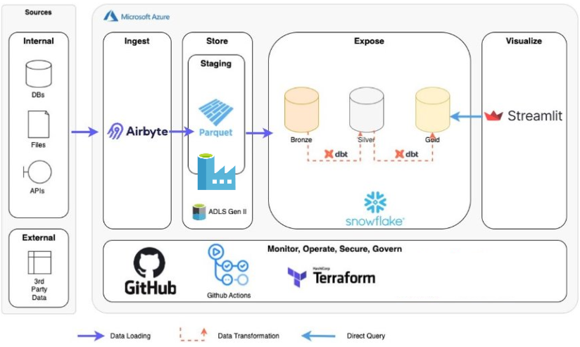

# Modern Data Stack - Infrastructure as Code

[](https://azure.microsoft.com/)
[](https://terraform.io/)
[](https://airbyte.com/)
[](https://docker.com/)

> **Infrastructure as Code pour un Modern Data Stack complet** intégrant **Azure Data Lake Storage (ADLS)**, **Airbyte OSS**, **Azure Data Factory**, et **Snowflake/dbt** avec orchestration Terraform.

## 🏗️ Architecture Globale



*Figure 1: Vue d'ensemble du Modern Data Stack avec flux de données*

## 🎯 Fonctionnalités

### ✨ **Infrastructure Azure**
- **Resource Group** : `ModernDataStack`
- **Storage Account ADLS Gen2** : `pimdsdatalake` 
- **Containers** : `foldercsv`, `folderparquet`, `rootmoduletest`, ou le container fournit par Keyrus.
- **Azure Data Factory** : Pipeline de conversion CSV → Parquet


### 🔄 **Pipeline d'Ingestion**
- **Airbyte OSS** : Ingestion temps réel via Terraform ou API REST
- **Sources** : Faker (test), ADLS Gen 2 Keyrus.
- **Destinations** : Azure Data Lake Storage Gen2
- **Formats** : CSV, Parquet avec compression optimisée

### 🛠️ **Outils de Transformation**
- **dbt** : Transformation de données SQL-first
- **Azure Data Factory** : Orchestration et monitoring
- **Support multi-environnements** : dev, staging, production

### 📊 **Visualisation**
- **Streamlit** : Dashboards et analyses
- **Intégration native** avec Snowflake - en construction

## 🚀 Quick Start

### 1. **Prérequis**

```bash
# Azure CLI
az login

# Terraform
terraform --version  # >= 1.1.0

# Docker pour Airbyte
docker --version
docker-compose --version
```

### 2. **Démarrage Airbyte OSS**

```bash
# Option 1: Docker Compose (recommandé)
cd airbyte/
docker-compose up -d

# Option 2: Installation classique
git clone https://github.com/airbytehq/airbyte.git
cd airbyte
./run-ab-platform.sh
```

**Accès** : http://localhost:8000 (airbyte/password)

### 3. **Déploiement Infrastructure**

#### **Approche Test/Validation**
```bash
cd terraform_modules_test/wsl_test/
chmod +x test_wsl.sh
./test_wsl.sh
```

#### **Déploiement Production**
```bash
cd terraform_modules_test/root/

# Linux/WSL/Bash
chmod +x deploy.sh
./deploy.sh
```

### 4. **Vérification**

```bash
# Azure Portal
# → Resource Groups → ModernDataStack → pimdsdatalake

# Airbyte UI
# → http://localhost:8000 → Connections
```

## 📁 Structure du Projet
Tout ce qu'il y a dans sandbox se retrouve sur diverse branches du projet.


```
IAC_Modern_Data_Stack/
├── README.md                          # 📖 Ce fichier
├── docker-compose.yml                 # 🐳 Airbyte + services
├── .gitignore                         # Exclusions Git
│
│
└── sandbox/                               # Dossier pour les pocs.
    ├── airbyte/                           # 🔄 Configuration Airbyte
    │   └── test_airbyte                   # Tests de connectivité
    │
    ├── datalake/                          # 💾 Configuration ADLS
    │   ├── azureDeployment.tf             # Déploiement Azure direct
    │   └── usageGuide.txt                 # Guide d'utilisation
    │
    ├── dbt/                               # 🛠️ Transformations dbt
    │   └── test_dbt                       # Tests et modèles
    │
    ├── metabase/                          # 📊 Configuration Metabase
    │   └── test_metabase                  # Dashboards de test
    │
    ├── terraform/                        # 🏗️ Modules Terraform (legacy)
│
└── terraform_modules_test/           # 🧪 Modules Terraform principaux
    ├── wsl_test/                      # ✅ Environnement de test validé
    │   ├── main.tf                    # Pipeline Faker → ADLS
    │   ├── test_wsl.sh               # Script de test automatisé
    │   ├── run_from_windows.ps1      # Lancement depuis Windows
    │   └── WSL_TROUBLESHOOTING.md     # Guide de dépannage
    │
    └── root/                          # 🏭 Environnement de production
        ├── main.tf                    # Configuration principale
        ├── deploy.sh / deploy.ps1     # Scripts de déploiement
        ├── test_pipeline.sh           # Tests de validation
        ├── configure_airbyte.sh       # Configuration API REST Airbyte
        │
        └── modules/                   # 📦 Modules Terraform
            ├── order-test/            # Infrastructure Azure
            │   └── submodules/azure-datalake/
            └── airbyte-ingestion/     # Pipeline Airbyte
                ├── main.tf
                ├── variables.tf
                ├── outputs.tf
                └── submodules/
                    ├── airbyte-sources/
                    └── airbyte-connections/
```

## 🎯 Cas d'Usage

### 1. **Test et Validation** 
```bash
# Environnement isolé pour tester les pipelines
cd terraform_modules_test/wsl_test/
./test_wsl.sh

# ✅ Pipeline validé : Faker (1000 records) → ADLS (CSV)
```

### 2. **Ingestion GCS → Azure**
```bash
# Configuration GCS
export GCS_BUCKET_NAME="your-bucket"
export GCS_SERVICE_ACCOUNT_KEY='{"type":"service_account",...}'

# Déploiement avec source GCS
cd terraform_modules_test/root/
./deploy.sh
```


## 🔧 Configuration Avancée

### **Variables d'Environnement**

```bash
# Airbyte
export AIRBYTE_SERVER_URL="http://localhost:8000"
export WORKSPACE_ID="5ae6b09b-fdec-41af-aed7-204436cc6af6"

# Azure
export AZURE_SUBSCRIPTION_ID="your-subscription-id"
export AZURE_RESOURCE_GROUP="ModernDataStack"

# GCS (optionnel)
export GCS_BUCKET_NAME="your-bucket"
export GCS_SERVICE_ACCOUNT_KEY="your-service-account-json"

# Terraform
export TF_LOG="INFO"
export TF_LOG_PATH="./terraform.log"
```

### **Personnalisation des Modules**

```hcl
# terraform_modules_test/root/main.tf
module "airbyte-ingestion" {
  source = "./modules/airbyte-ingestion"
  
  # Configuration personnalisée
  csv_container_name     = "your-csv-folder"
  parquet_container_name = "your-parquet-folder"
  
  # Sources multiples
  gcs_bucket_name = var.gcs_bucket_name
  faker_records_count = 5000  # Plus de données
}
```

## 🧪 Tests et Validation

### **Tests Automatisés**
```bash
# Test complet de bout en bout
cd terraform_modules_test/wsl_test/
./test_wsl.sh

# Test de l'infrastructure Azure seule
cd terraform_modules_test/root/
terraform plan -target="module.order-test"

# Test du pipeline Airbyte
./test_pipeline.sh
```

### **Monitoring**
```bash
# Logs Terraform
tail -f terraform.log

# Statut Airbyte
curl http://localhost:8000/api/v1/health

# Vérification Azure
az storage blob list --container-name foldercsv --account-name pimdsdatalake
```

## 🚨 Troubleshooting

### **Problèmes Courants**

| Problème | Solution |
|----------|----------|
| Airbyte 405 Error | Vérifier version provider + credentials |
| Azure 401 Unauthorized | `az login` + vérifier subscription |
| WSL Networking Issues | Voir `WSL_TROUBLESHOOTING.md` |

### **Debug Mode**
```bash
# Terraform verbose
export TF_LOG=DEBUG

# Test de connectivité
curl -v http://localhost:8000/api/v1/health

# Vérification Azure CLI
az account show
```

## 🌟 Roadmap

### **Version Actuelle (v1.0)**
- ✅ Infrastructure Azure (ADLS, Data Factory)
- ✅ Airbyte OSS (Faker, GCS sources)
- ✅ Pipeline Ingestion → ADLS Gen2 → CSV → Parquet


### **Prochaines Versions**
- 🔄 **v1.1** : Intégration Snowflake/dbt complète dans le pipeline (pour l'instant isolé en fin de chaine)
- 📊 **v1.2** : Rattachage du UseCase Taxi (pour l'instant juste mise des fichiers Taxi dans ADLS Gen2, mais dbt+streamlit fait pour taxis)
- 🔒 **v1.3** : Sécurité et RBAC
- ☁️ **v1.4** : Multi-cloud (AWS, GCP)
- 🤖 **v1.5** : CI/CD Pipeline

## 🤝 Contribution

### **Development Workflow**
```bash
# 1. Créer une branche
git checkout -b feature/nouvelle-fonctionnalite

# 2. Tester en local
cd terraform_modules_test/wsl_test/
./test_wsl.sh

# 3. Valider en production
cd terraform_modules_test/root/
terraform plan

# 4. Submit PR
```

### **Standards**
- **Terraform** : Format avec `terraform fmt`
- **Documentation** : Mise à jour des README
- **Sécurité** : Pas de credentials en dur


## 📄 License

Ce projet est développé dans le cadre d'un stage chez **Keyrus** pour l'industrialisation d'un Modern Data Stack avec Infrastructure as Code.

**Auteurs** : Pierre Gosson, Amin Akkouche, Valentin Pisano-Banchet

**Organisation** : Keyrus  
**Période** : 2025  

---